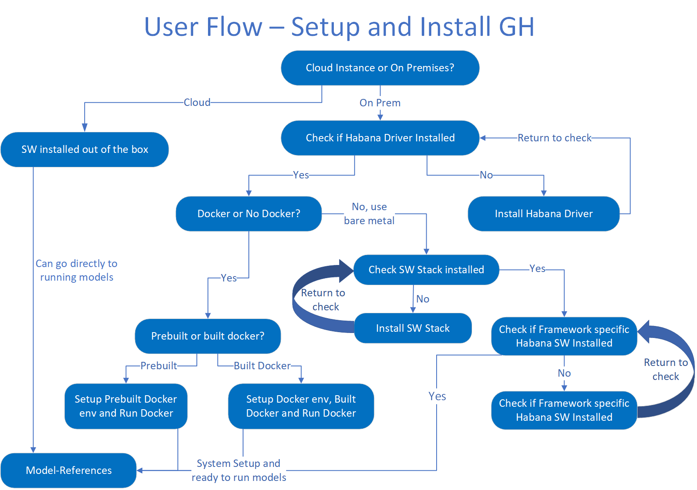

# Gaudi Setup and Installation

## Table of Contents
- [Overview](#overview)
- [Cloud](#cloud)
- [On Premises](#on-premises)
- [Install Habana Driver](#install-habana-driver)
- [Check Habana Package Installation for no Docker](#check-habana-package-installation-for-no-docker)
- [Install SW Stack](#install-sw-stack)
- [Check TF/Horovod Habana packages](#check-tfhorovod-habana-packages)
- [Install TF python packages](#install-tfhorovod-python-packages)
- [How to Build Docker Images from Habana Dockerfiles](#how-to-build-docker-images-from-habana-dockerfiles)
- [Pull prebuilt Docker image](#pull-prebuilt-docker-image)
- [Run Reference Models](#run-reference-models)
- [Additional setup checks](#additional-setup-checks)
- [Additional links](#additional-links)
- [Additional scripts and add-ons](#additional-scripts-and-add-ons)

<br />

---

<br />

## Overview
Welcome to Setup and Installation guide!

This respository is a "quick start guide" for end users looking to setup their environment.

In this Readme you will be directed through the flow of setting up system to run deep learning models on Habana Hardware. Please follow the instructions and answer the questions to be directed through the flow according to your setup/preference.  

A visualization of the flow is provided below to help better understand the available paths:  



At the end of this flow you will be ready to continue to Habana's model references to start running models on your system using Habana Devices.
<br>
<br>

<center>

### Are you using a Cloud computing instance or setting up an system on premises?
[Cloud](#Cloud) • [On Premises](#On-Premises)

</center>

<br />

---

<br />

## Cloud

Please follow the directions from your cloud service provider to setup your instance.  
If a Habana instance is selected from your cloud service provider, it will be already setup in most cases to run out of the box.  
<br />

<center>

Please proceed to [Run Reference Models](#Run-Reference-Models)

</center>

<br />

---

<br />

## On Premises

Please ensure the driver is installed on your system using the following command:
<details>
<summary>Ubuntu distributions</summary>

```
dpkg -l | grep habanalabs-dkms
```

</details>
<details>
<summary>CentOS/Amazon linux 2 distributions</summary>

```
rpm -qa | grep habanalabs
```

</details>
<br />

<center>

### Does the command above show the package installed?
[Yes (Will you be using docker?)](#Will-you-be-using-docker) • [No (Install Habana Driver)](#Install-Habana-Driver)

</center>

<br />

---

<br />

## Install Habana Driver
<details>
<summary>Ubuntu distributions</summary>

* <details>
  <summary>Ubuntu 18.04</summary>

  ### Setup package fetching
  1. Download and install the public key:  
  ```
  curl -X GET https://vault.habana.ai/artifactory/api/gpg/key/public | sudo apt-key add -
  ```
  2. Create an apt source file /etc/apt/sources.list.d/artifactory.list.
  3. Add the following content to the file:
  ```
  deb https://vault.habana.ai/artifactory/debian bionic main
  ```
  4. Update Debian cache:  
  ```
  sudo dpkg --configure -a
  sudo apt-get update
  ```  
  ### KMD Dependencies
  1. Install Deb libraries using the following command:  
  ```
  sudo apt install dkms libelf-dev
  ```
  2. Install headers:  
  ```
  sudo apt install linux-headers-$(uname -r)
  ```
  3. After kernel upgrade, please reboot your machine.

  ### Setup base drivers
  If the driver needs to be updated or installed on a fresh system, please use the following directions (Ubuntu 18.04):

  1. Remove old packages habanalabs-dkms
  ```
  sudo dpkg -P habanalabs-dkms
  ```
  2. Download and install habanalabs-dkms
  ```
  sudo apt install -y habanalabs-dkms=0.15.1-37
  ```
  3. Load the driver
  ```
  sudo modprobe habanalabs
  ```
  </details>
* <details>
  <summary>Ubuntu 20.04</summary>

  ### Setup package fetching
  1. Download and install the public key:  
  ```
  curl -X GET https://vault.habana.ai/artifactory/api/gpg/key/public | sudo apt-key add -
  ```
  2. Create an apt source file /etc/apt/sources.list.d/artifactory.list.
  3. Add the following content to the file:
  ```
  deb https://vault.habana.ai/artifactory/debian focal main
  ```
  4. Update Debian cache:  
  ```
  sudo dpkg --configure -a
  sudo apt-get update
  ```  
  ### KMD Dependencies
  1. Install Deb libraries using the following command:  
  ```
  sudo apt install dkms libelf-dev
  ```
  2. Install headers:  
  ```
  sudo apt install linux-headers-$(uname -r)
  ```
  3. After kernel upgrade, please reboot your machine.

  ### Setup base drivers
  If the driver needs to be updated or installed on a fresh system, please use the following directions (Ubuntu 20.04):

  1. Remove old packages habanalabs-dkms
  ```
  sudo dpkg -P habanalabs-dkms
  ```
  2. Download and install habanalabs-dkms
  ```
  sudo apt install -y habanalabs-dkms=0.15.1-37
  ```
  3. Load the driver
  ```
  sudo modprobe habanalabs
  ```
  </details>
</details>

<details>
<summary>CentOS distributions</summary>

### Setup package fetching
1. Create /etc/yum.repos.d/Habana-Vault.repo.
2. Add the following content to the file:
```
[vault]

name=Habana Vault

baseurl=https://vault.habana.ai/artifactory/centos7

enabled=1

gpgcheck=0

gpgkey=https://vault.habana.ai/artifactory/centos7/repodata/repomod.xml.key

repo_gpgcheck=0
```
3. Update YUM cache by running the following command:
```
sudo yum makecache
```
4. Verify correct binding by running the following command:
```
yum search habana
```
This will search for and list all packages with the word Habana.

### KMD Dependencies
1. Check your Linux kernel version:
```
uname -r
```
2. Install headers: 
```
sudo yum install kernel-devel
```
3. After kernel upgrade, please reboot your machine.

### Additional Dependencies
Add yum-utils:
```
sudo yum install -y sudo yum-utils
```  

### Setup base drivers
If the driver needs to be updated or installed on a fresh system, please use the following directions (Centos):

1. Remove the previous driver package:
```
sudo yum remove habanalabs*
```
2. Download and install new driver:
```
sudo yum install habanalabs-0.15.1-37* -y
```
3. Load the driver
```
sudo modprobe habanalabs
```  
</details>
<details>
<summary>Amazon linux 2 distributions</summary>

### Setup package fetching
1. Create /etc/yum.repos.d/Habana-Vault.repo.
2. Add the following content to the file:
```
[vault]

name=Habana Vault

baseurl=https://vault.habana.ai/artifactory/AmazonLinux2

enabled=1

gpgcheck=0

gpgkey=https://vault.habana.ai/artifactory/AmazonLinux2/repodata/repomod.xml.key

repo_gpgcheck=0
```
3. Update YUM cache by running the following command:
```
sudo yum makecache
```
4. Verify correct binding by running the following command:
```
yum search habana
```
This will search for and list all packages with the word Habana.

### KMD Dependencies
1. Check your Linux kernel version:
```
uname -r
```
2. Install headers: 
```
sudo yum install kernel-devel
```
3. After kernel upgrade, please reboot your machine.

### Additional Dependencies
Add yum-utils:
```
sudo yum install -y sudo yum-utils
```  

### Setup base drivers
If the driver needs to be updated or installed on a fresh system, please use the following directions (Amazon Linux 2):

1. Remove the previous driver package:
```
sudo yum remove habanalabs*
```
2. Download and install new driver:
```
sudo yum install habanalabs-0.15.1-37* -y
```
3. Load the driver
```
sudo modprobe habanalabs
```  
</details>

<center>

### Please go back and check that driver was installed
[Habana Driver Check](#On-Premises)

</center>
<br />

---

<br />
<center>

### Will you be using Docker?
[Docker](#Do-you-want-to-use-prebuilt-docker-or-build-docker-yourself) • [No Docker](#Check-Habana-Package-Installation-For-No-Docker)

</center>

<br />

---

<br />

## Check Habana Package Installation for no Docker
Please ensure the following software packages are installed on your system:
### Required packages:
* habanalabs-dkms_all – installs the PCIe driver. (Should already be installed in previous steps)
* habanalabs-graph-_all – installs the Graph Compiler and the run-time.
* habanalabs-thunk-_all – installs the thunk library.
* habanalabs-firmware - installs the Gaudi Firmware.

### Optional packages:
* habanalabs-firmware-tools – installs various Firmware tools (hlml, hl-smi, etc).
* habanalabs-qual – installs the qualification application package. See See [Gaudi Qualification Library.](https://docs.habana.ai/projects/SynapeAI-Gaudi/en/latest/Qualification_Library/GAUDI_Qualification_Library.html#gaudi-qualification-library)
* habanalabs-container-runtime - installs the container runtime library.

Use the following commands to fetch current packages on the system:
<details>
<summary>Ubuntu distributions</summary>

```
dpkg -l | grep habana
```

</details>
<details>
<summary>CentOS/Amazon linux 2 distributions</summary>

```
rpm -qa | grep habana
```

</details>
<br />

<center>

### Are the required packages installed on your system with your expected version?
[Yes](#Check-TFHorovod-Habana-packages) • [No](#Install-SW-Stack)

</center>

<br />

---

<br />

## Install SW Stack
<details>
<summary>Ubuntu distributions</summary>

* <details>
  <summary>Ubuntu 18.04</summary>

  ### Setup package fetching
  1. Download and install the public key:  
  ```
  curl -X GET https://vault.habana.ai/artifactory/api/gpg/key/public | sudo apt-key add -
  ```
  2. Create an apt source file /etc/apt/sources.list.d/artifactory.list.
  3. Add the following content to the file:
  ```
  deb https://vault.habana.ai/artifactory/debian bionic main
  ```
  4. Update Debian cache:  
  ```
  sudo dpkg --configure -a
  sudo apt-get update
  ```  
  ### Graph compiler and run-time installation
  To install the graph compiler and run-time, use the following command:
  ```
  sudo apt install -y habanalabs-graph=0.15.1-37
  ```
  ### Thunk installation
  To install the thunk library, use the following command:
  ```
  sudo apt install -y habanalabs-thunk=0.15.1-37
  ```
  ### Update FW
  To update the firmware, follow the below steps:  
  1. Install the Firmware package:
  ```
  sudo apt install -y habanalabs-firmware=0.15.1-37
  ```
  2. Remove the driver:
  ```
  sudo rmmod habanalabs
  ```
  3. Update the device’s FW:
  ```
  sudo hl-fw-loader
  ```
  4. Start the driver:
  ```
  sudo modprobe habanalabs
  ```
  ### (Optional) FW tools installation
  To install the firmware tools, use the following command:
  ```
  sudo apt install -y habanalabs-firmware-tools=0.15.1-37
  ```

  ### (Optional) qual installation
  To install hl_qual, use the following command:
  ```
  sudo apt install -y habanalabs-qual=0.15.1-37
  ```

  </details>
* <details>
  <summary>Ubuntu 20.04</summary>

  ### Setup package fetching
  1. Download and install the public key:  
  ```
  curl -X GET https://vault.habana.ai/artifactory/api/gpg/key/public | sudo apt-key add -
  ```
  2. Create an apt source file /etc/apt/sources.list.d/artifactory.list.
  3. Add the following content to the file:
  ```
  deb https://vault.habana.ai/artifactory/debian focal main
  ```
  4. Update Debian cache:  
  ```
  sudo dpkg --configure -a
  sudo apt-get update
  ```  
  ### Graph compiler and run-time installation
  To install the graph compiler and run-time, use the following command:
  ```
  sudo apt install -y habanalabs-graph=0.15.1-37
  ```
  ### Thunk installation
  To install the thunk library, use the following command:
  ```
  sudo apt install -y habanalabs-thunk=0.15.1-37
  ```
  ### Update FW
  To update the firmware, follow the below steps:  
  1. Install the Firmware package:
  ```
  sudo apt install -y habanalabs-firmware=0.15.1-37
  ```
  2. Remove the driver:
  ```
  sudo rmmod habanalabs
  ```
  3. Update the device’s FW:
  ```
  sudo hl-fw-loader
  ```
  4. Start the driver:
  ```
  sudo modprobe habanalabs
  ```
  ### (Optional) FW tools installation
  To install the firmware tools, use the following command:
  ```
  sudo apt install -y habanalabs-firmware-tools=0.15.1-37
  ```

  ### (Optional) qual installation
  To install hl_qual, use the following command:
  ```
  sudo apt install -y habanalabs-qual=0.15.1-37
  ```
  </details>
</details>

<details>
<summary>CentOS distributions</summary>

### Setup package fetching
1. Create /etc/yum.repos.d/Habana-Vault.repo.
2. Add the following content to the file:
```
[vault]

name=Habana Vault

baseurl=https://vault.habana.ai/artifactory/centos7

enabled=1

gpgcheck=0

gpgkey=https://vault.habana.ai/artifactory/centos7/repodata/repomod.xml.key

repo_gpgcheck=0
```
3. Update YUM cache by running the following command:
```
sudo yum makecache
```
4. Verify correct binding by running the following command:
```
yum search habana
```
This will search for and list all packages with the word Habana.

### Graph compiler and run-time installation
To install the graph compiler and run-time, use the following command:
```
sudo yum install habanalabs-graph-0.15.1-37* -y
```
### Thunk installation
To install the thunk library, use the following command:
```
sudo yum install habanalabs-thunk-0.15.1-37* -y
```
### Update FW
To update the firmware, follow the below steps:  
1. Install the Firmware package:
```
sudo yum install habanalabs-firmware-0.15.1-37* -y
```
2. Remove the driver:
```
sudo rmmod habanalabs
```
3. Update the device’s FW:
```
sudo hl-fw-loader
```
4. Start the driver:
```
sudo modprobe habanalabs
```
### (Optional) FW tools installation
To install the firmware tools, use the following command:
```
sudo yum install habanalabs-firmware-tools-0.15.1-37* -y
```

### (Optional) qual installation
To install hl_qual, use the following command:
```
sudo yum install habanalabs-qual-0.15.1-37* -y
```
</details>
<details>
<summary>Amazon linux 2 distributions</summary>

### Setup package fetching
1. Create /etc/yum.repos.d/Habana-Vault.repo.
2. Add the following content to the file:
```
[vault]

name=Habana Vault

baseurl=https://vault.habana.ai/artifactory/AmazonLinux2

enabled=1

gpgcheck=0

gpgkey=https://vault.habana.ai/artifactory/AmazonLinux2/repodata/repomod.xml.key

repo_gpgcheck=0
```
3. Update YUM cache by running the following command:
```
sudo yum makecache
```
4. Verify correct binding by running the following command:
```
yum search habana
```
This will search for and list all packages with the word Habana.

### Graph compiler and run-time installation
To install the graph compiler and run-time, use the following command:
```
sudo yum install habanalabs-graph-0.15.1-37* -y
```
### Thunk installation
To install the thunk library, use the following command:
```
sudo yum install habanalabs-thunk-0.15.1-37* -y
```
### Update FW
To update the firmware, follow the below steps:  
1. Install the Firmware package:
```
sudo yum install habanalabs-firmware-0.15.1-37* -y
```
2. Remove the driver:
```
sudo rmmod habanalabs
```
3. Update the device’s FW:
```
sudo hl-fw-loader
```
4. Start the driver:
```
sudo modprobe habanalabs
```
### (Optional) FW tools installation
To install the firmware tools, use the following command:
```
sudo yum install habanalabs-firmware-tools-0.15.1-37* -y
```

### (Optional) qual installation
To install hl_qual, use the following command:
```
sudo yum install habanalabs-qual-0.15.1-37* -y
```
</details>

<center>

### Please go back and check that the packages were installed
[Habana Software Package Check](#Check-Habana-Package-Installation-For-No-Docker)

</center>

<br />

---

<br />

## Check TF/Horovod Habana packages
Please ensure the following python packages are installed on your system:
* habana-tensorflow - Libraries and modules needed to execute TensorFlow on a single Gaudi device.
* habana-horovod - Libraries and modules needed to execute TensorFlow on an HLS machine.

Use the following commands to fetch current python packages on the system:
```
pip list | grep habana
```


<center>

### Are the required python packages installed on your system?
[Yes](#Run-Reference-Models) • [No](#Install-TFHorovod-python-packages)

</center>

<br />

---

<br />

## Install TF/Horovod python packages
### Install habana-tensorflow
1. Before installing habana-tensorflow, install TensorFlow. The Habana package currently supports TensorFlow versions 2.4.1 and 2.5.0. If no TensorFlow package is available, PIP will automatically install the latest supported version.
```
# Either
python3 -m pip install tensorflow-cpu==2.4.1
# Or
python3 -m pip install tensorflow-cpu==2.5.0
```

2. habana-tensorflow is available in the Habana Vault. To allow PIP to search for the habana-tensorflow package, configure PIP:
```
python3 -m pip config --user set global.index https://vault.habana.ai/artifactory/api/pypi/gaudi-python
python3 -m pip config --user set global.index-url https://vault.habana.ai/artifactory/api/pypi/gaudi-python/simple
python3 -m pip config --user set global.trusted-host vault.habana.ai
```
3. Once PIP is configured, run:
```
python3 -m pip install habana-tensorflow
```
4. Run the below command to make sure the habana-tensorflow package is properly installed:
```
python3 -c "import habana_frameworks.tensorflow as htf; print(htf.__version__)"
```
If everything is set up properly, the above command will print the currently installed package version.

### Install habana-horovod
Install the habana-horovod package to get multi-node support. The following lists the prerequisites for installing this package:

* OpenMPI 4.0.2.
* Stock horovod package must not be installed.

1. Set up the OpenMPI 4.0.2 as shown below:
```
wget https://download.open-mpi.org/release/open-mpi/v4.0/openmpi-4.0.2.tar.gz
gunzip -c openmpi-4.0.2.tar.gz | tar xf -
cd openmpi-4.0.2/ && ./configure --prefix=/usr/local/share/openmpi
make -j 8 && make install && touch ~root/openmpi-4.0.2_installed
cp LICENSE /usr/local/share/openmpi/

# Necessary env flags to install habana-horovod module
export MPI_ROOT=/usr/local/share/openmpi
export LD_LIBRARY_PATH=$MPI_ROOT/lib:$LD_LIBRARY_PATH
export OPAL_PREFIX=$MPI_ROOT
export PATH=$MPI_ROOT/bin:$PATH
```
1. habana-horovod is also stored in Habana Vault. To allow PIP to search for the habana-horovod package, configure PIP:
```
python3 -m pip config --user set global.index https://vault.habana.ai/artifactory/api/pypi/gaudi-python
python3 -m pip config --user set global.index-url https://vault.habana.ai/artifactory/api/pypi/gaudi-python/simple
python3 -m pip config --user set global.trusted-host vault.habana.ai
```
3. Install habana-horovod:
```
python3 -m pip install habana-horovod
```

<br />

<center>

### Please go back and check that the packages were installed
[Check TF/Horovod Habana packages](#check-tfhorovod-habana-packages)

</center>

<br />

---

<br />

<center>

### Do you want to use prebuilt docker or build docker yourself?
[Prebuilt](#Pull-prebuilt-Docker-image) • [Build Docker](#How-to-Build-Docker-Images-from-Habana-Dockerfiles)

</center>


<br />

---

<br />

## How to Build Docker Images from Habana Dockerfiles
1. Download Docker files and build script from Github to local directory

2. Run build script to generate Docker image
```
./docker_build.sh mode [base,tensorflow,pytorch] os [ubuntu18.04,ubuntu20.04,amzn2] tf_version [2.4.1, 2.5.0]
```
For example:
```
./docker_build.sh tensorflow ubuntu20.04 2.4.1
```

### Install habana-container-runtime package
<details>
<summary>Ubuntu distributions</summary>

* <details>
  <summary>Ubuntu 18.04</summary>

  #### Setup package fetching
  1. Download and install the public key:  
  ```
  curl -X GET https://vault.habana.ai/artifactory/api/gpg/key/public | sudo apt-key add -
  ```
  2. Create an apt source file /etc/apt/sources.list.d/artifactory.list.
  3. Add the following content to the file:
  ```
  deb https://vault.habana.ai/artifactory/debian bionic main
  ```
  4. Update Debian cache:  
  ```
  sudo dpkg --configure -a
  sudo apt-get update
  ```  
  #### Install habana-container-runtime:
  Install the `habana-container-runtime` package:
  ```
  sudo apt install -y habanalabs-container-runtime=0.15.1-37
  ```
  #### Docker Engine setup

  To register the `habana` runtime, use the method below that is best suited to your environment.
  You might need to merge the new argument with your existing configuration.

  ##### Daemon configuration file
  ```bash
  sudo tee /etc/docker/daemon.json <<EOF
  {
      "runtimes": {
          "habana": {
              "path": "/usr/bin/habana-container-runtime",
              "runtimeArgs": []
          }
      }
  }
  EOF
  sudo systemctl restart docker
  ```

  Optional: Reconfigure the default runtime by adding the following to `/etc/docker/daemon.json`:
  ```
  "default-runtime": "habana"
  ```
  It will look similar to this:
  ```
  {
      "default-runtime": "habana",
      "runtimes": {
          "habana": {
              "path": "/usr/bin/habana-container-runtime",
              "runtimeArgs": []
          }
      }
  }
  ```
  </details>

* <details>
  <summary>Ubuntu 20.04</summary>

  #### Setup package fetching
  1. Download and install the public key:  
  ```
  curl -X GET https://vault.habana.ai/artifactory/api/gpg/key/public | sudo apt-key add -
  ```
  2. Create an apt source file /etc/apt/sources.list.d/artifactory.list.
  3. Add the following content to the file:
  ```
  deb https://vault.habana.ai/artifactory/debian focal main
  ```
  4. Update Debian cache:  
  ```
  sudo dpkg --configure -a
  sudo apt-get update
  ```  
  #### Install habana-container-runtime:
  Install the `habana-container-runtime` package:
  ```
  sudo apt install -y habanalabs-container-runtime=0.15.1-37
  ```
  #### Docker Engine setup

  To register the `habana` runtime, use the method below that is best suited to your environment.
  You might need to merge the new argument with your existing configuration.

  ##### Daemon configuration file
  ```bash
  sudo tee /etc/docker/daemon.json <<EOF
  {
      "runtimes": {
          "habana": {
              "path": "/usr/bin/habana-container-runtime",
              "runtimeArgs": []
          }
      }
  }
  EOF
  sudo systemctl restart docker
  ```

  Optional: Reconfigure the default runtime by adding the following to `/etc/docker/daemon.json`:
  ```
  "default-runtime": "habana"
  ```
  It will look similar to this:
  ```
  {
      "default-runtime": "habana",
      "runtimes": {
          "habana": {
              "path": "/usr/bin/habana-container-runtime",
              "runtimeArgs": []
          }
      }
  }
  ```
  </details>
</details>

<details>
<summary>CentOS distributions</summary>

#### Setup package fetching
1. Create /etc/yum.repos.d/Habana-Vault.repo.
2. Add the following content to the file:
```
[vault]

name=Habana Vault

baseurl=https://vault.habana.ai/artifactory/centos7

enabled=1

gpgcheck=0

gpgkey=https://vault.habana.ai/artifactory/centos7/repodata/repomod.xml.key

repo_gpgcheck=0
```
3. Update YUM cache by running the following command:
```
sudo yum makecache
```
4. Verify correct binding by running the following command:
```
yum search habana
```
This will search for and list all packages with the word Habana.

#### Install habana-container-runtime:
Install the `habana-container-runtime` package:
```
sudo yum install habanalabs-container-runtime-0.15.1-37* -y
```
#### Docker Engine setup

To register the `habana` runtime, use the method below that is best suited to your environment.
You might need to merge the new argument with your existing configuration.

##### Daemon configuration file
```bash
sudo tee /etc/docker/daemon.json <<EOF
{
    "runtimes": {
        "habana": {
            "path": "/usr/bin/habana-container-runtime",
            "runtimeArgs": []
        }
    }
}
EOF
sudo systemctl restart docker
```

Optional: Reconfigure the default runtime by adding the following to `/etc/docker/daemon.json`:
```
"default-runtime": "habana"
```
It will look similar to this:
```
{
    "default-runtime": "habana",
    "runtimes": {
        "habana": {
            "path": "/usr/bin/habana-container-runtime",
            "runtimeArgs": []
        }
    }
}
```
</details>

<details>
<summary>Amazon linux distributions</summary>

#### Setup package fetching
1. Create /etc/yum.repos.d/Habana-Vault.repo.
2. Add the following content to the file:
```
[vault]

name=Habana Vault

baseurl=https://vault.habana.ai/artifactory/AmazonLinux2

enabled=1

gpgcheck=0

gpgkey=https://vault.habana.ai/artifactory/AmazonLinux2/repodata/repomod.xml.key

repo_gpgcheck=0
```
3. Update YUM cache by running the following command:
```
sudo yum makecache
```
4. Verify correct binding by running the following command:
```
yum search habana
```
This will search for and list all packages with the word Habana.

#### Install habana-container-runtime:
Install the `habana-container-runtime` package:
```
sudo yum install habanalabs-container-runtime-0.15.1-37* -y
```
### Docker Engine setup

To register the `habana` runtime, use the method below that is best suited to your environment.
You might need to merge the new argument with your existing configuration.

#### Daemon configuration file
```bash
sudo tee /etc/docker/daemon.json <<EOF
{
    "runtimes": {
        "habana": {
            "path": "/usr/bin/habana-container-runtime",
            "runtimeArgs": []
        }
    }
}
EOF
sudo systemctl restart docker
```

Optional: Reconfigure the default runtime by adding the following to `/etc/docker/daemon.json`:
```
"default-runtime": "habana"
```
It will look similar to this:
```
{
    "default-runtime": "habana",
    "runtimes": {
        "habana": {
            "path": "/usr/bin/habana-container-runtime",
            "runtimeArgs": []
        }
    }
}
```
</details>
<br />

### Launch Docker image that was built
**NOTE:** Please download dataset prior to running docker and mount the location of your dataset to the docker by adding the below flag for example (Host dataset location `/opt/datasets/imagenet` will mount to `/datasets/imagenet` inside the docker):
```
-v /opt/datasets/imagenet:/datasets/imagenet
```
### Run docker command
**NOTE:** Modify below image name path $OS to match the OS chosen when building [ubuntu18.04,ubuntu20.04,amzn2]  
**NOTE:** Modify below image name path $MODE to match the mode chosen when building [base,tensorflow,pytorch]  
**NOTE:** Modify below image name path $TF_VERSION to match the TF version chosen when building [2.4.1, 2.5.0]  

```
docker run -it --runtime=habana -e HABANA_VISIBLE_DEVICES=all -e OMPI_MCA_btl_vader_single_copy_mechanism=none --cap-add=sys_nice --net=host --ipc=host artifactory.habana-labs.com/docker-local/0.15.1/$OS/habanalabs/$MODE-installer-tf-cpu-$TF_VERSION:0.15.1-37
```

**OPTIONAL:** Add the following flag to mount a local host share folder to the docker in order to be able to transfer files out of docker:

```
-v ~/shared:/root/shared
```

<br />

<center>

Setup complete, please proceed to [Run Reference Models](#Run-Reference-Models)

</center>

<br />

---

<br />

## Pull prebuilt Docker image

### Install habana-container-runtime package
<details>
<summary>Ubuntu distributions</summary>

* <details>
  <summary>Ubuntu 18.04</summary>

  #### Setup package fetching
  1. Download and install the public key:  
  ```
  curl -X GET https://vault.habana.ai/artifactory/api/gpg/key/public | sudo apt-key add -
  ```
  2. Create an apt source file /etc/apt/sources.list.d/artifactory.list.
  3. Add the following content to the file:
  ```
  deb https://vault.habana.ai/artifactory/debian bionic main
  ```
  4. Update Debian cache:  
  ```
  sudo dpkg --configure -a
  sudo apt-get update
  ```  
  #### Install habana-container-runtime:
  Install the `habana-container-runtime` package:
  ```
  sudo apt install -y habanalabs-container-runtime=0.15.1-37
  ```
  #### Docker Engine setup

  To register the `habana` runtime, use the method below that is best suited to your environment.
  You might need to merge the new argument with your existing configuration.

  ##### Daemon configuration file
  ```bash
  sudo tee /etc/docker/daemon.json <<EOF
  {
      "runtimes": {
          "habana": {
              "path": "/usr/bin/habana-container-runtime",
              "runtimeArgs": []
          }
      }
  }
  EOF
  sudo systemctl restart docker
  ```

  Optional: Reconfigure the default runtime by adding the following to `/etc/docker/daemon.json`:
  ```
  "default-runtime": "habana"
  ```
  It will look similar to this:
  ```
  {
      "default-runtime": "habana",
      "runtimes": {
          "habana": {
              "path": "/usr/bin/habana-container-runtime",
              "runtimeArgs": []
          }
      }
  }
  ```
  </details>

* <details>
  <summary>Ubuntu 20.04</summary>

  #### Setup package fetching
  1. Download and install the public key:  
  ```
  curl -X GET https://vault.habana.ai/artifactory/api/gpg/key/public | sudo apt-key add -
  ```
  2. Create an apt source file /etc/apt/sources.list.d/artifactory.list.
  3. Add the following content to the file:
  ```
  deb https://vault.habana.ai/artifactory/debian focal main
  ```
  4. Update Debian cache:  
  ```
  sudo dpkg --configure -a
  sudo apt-get update
  ```  
  #### Install habana-container-runtime:
  Install the `habana-container-runtime` package:
  ```
  sudo apt install -y habanalabs-container-runtime=0.15.1-37
  ```
  #### Docker Engine setup

  To register the `habana` runtime, use the method below that is best suited to your environment.
  You might need to merge the new argument with your existing configuration.

  ##### Daemon configuration file
  ```bash
  sudo tee /etc/docker/daemon.json <<EOF
  {
      "runtimes": {
          "habana": {
              "path": "/usr/bin/habana-container-runtime",
              "runtimeArgs": []
          }
      }
  }
  EOF
  sudo systemctl restart docker
  ```

  Optional: Reconfigure the default runtime by adding the following to `/etc/docker/daemon.json`:
  ```
  "default-runtime": "habana"
  ```
  It will look similar to this:
  ```
  {
      "default-runtime": "habana",
      "runtimes": {
          "habana": {
              "path": "/usr/bin/habana-container-runtime",
              "runtimeArgs": []
          }
      }
  }
  ```
  </details>
</details>

<details>
<summary>CentOS distributions</summary>

#### Setup package fetching
1. Create /etc/yum.repos.d/Habana-Vault.repo.
2. Add the following content to the file:
```
[vault]

name=Habana Vault

baseurl=https://vault.habana.ai/artifactory/centos7

enabled=1

gpgcheck=0

gpgkey=https://vault.habana.ai/artifactory/centos7/repodata/repomod.xml.key

repo_gpgcheck=0
```
3. Update YUM cache by running the following command:
```
sudo yum makecache
```
4. Verify correct binding by running the following command:
```
yum search habana
```
This will search for and list all packages with the word Habana.

#### Install habana-container-runtime:
Install the `habana-container-runtime` package:
```
sudo yum install habanalabs-container-runtime-0.15.1-37* -y
```
#### Docker Engine setup

To register the `habana` runtime, use the method below that is best suited to your environment.
You might need to merge the new argument with your existing configuration.

##### Daemon configuration file
```bash
sudo tee /etc/docker/daemon.json <<EOF
{
    "runtimes": {
        "habana": {
            "path": "/usr/bin/habana-container-runtime",
            "runtimeArgs": []
        }
    }
}
EOF
sudo systemctl restart docker
```

Optional: Reconfigure the default runtime by adding the following to `/etc/docker/daemon.json`:
```
"default-runtime": "habana"
```
It will look similar to this:
```
{
    "default-runtime": "habana",
    "runtimes": {
        "habana": {
            "path": "/usr/bin/habana-container-runtime",
            "runtimeArgs": []
        }
    }
}
```
</details>

<details>
<summary>Amazon linux distributions</summary>

#### Setup package fetching
1. Create /etc/yum.repos.d/Habana-Vault.repo.
2. Add the following content to the file:
```
[vault]

name=Habana Vault

baseurl=https://vault.habana.ai/artifactory/AmazonLinux2

enabled=1

gpgcheck=0

gpgkey=https://vault.habana.ai/artifactory/AmazonLinux2/repodata/repomod.xml.key

repo_gpgcheck=0
```
3. Update YUM cache by running the following command:
```
sudo yum makecache
```
4. Verify correct binding by running the following command:
```
yum search habana
```
This will search for and list all packages with the word Habana.

#### Install habana-container-runtime:
Install the `habana-container-runtime` package:
```
sudo yum install habanalabs-container-runtime-0.15.1-37* -y
```
### Docker Engine setup

To register the `habana` runtime, use the method below that is best suited to your environment.
You might need to merge the new argument with your existing configuration.

#### Daemon configuration file
```bash
sudo tee /etc/docker/daemon.json <<EOF
{
    "runtimes": {
        "habana": {
            "path": "/usr/bin/habana-container-runtime",
            "runtimeArgs": []
        }
    }
}
EOF
sudo systemctl restart docker
```

Optional: Reconfigure the default runtime by adding the following to `/etc/docker/daemon.json`:
```
"default-runtime": "habana"
```
It will look similar to this:
```
{
    "default-runtime": "habana",
    "runtimes": {
        "habana": {
            "path": "/usr/bin/habana-container-runtime",
            "runtimeArgs": []
        }
    }
}
```
</details>
<br />

### Pull and launch Docker image
**NOTE:** Please download dataset prior to running docker and mount the location of your dataset to the docker by adding the below flag for example (Host dataset location `/opt/datasets/imagenet` will mount to `/datasets/imagenet` inside the docker):
```
-v /opt/datasets/imagenet:/datasets/imagenet
```

### Pull and Run commands

<details>
<summary>Ubuntu 20.04</summary>

* <details>
  <summary>TF 2.4.1</summary>

  ### Pull docker
  ```
  docker pull vault.habana.ai/gaudi-docker/0.15.1/ubuntu20.04/habanalabs/tensorflow-installer-tf-cpu-2.4.1:0.15.1-37
  ```
  ### Run docker
  ```
  docker run -it --runtime=habana -e HABANA_VISIBLE_DEVICES=all -e OMPI_MCA_btl_vader_single_copy_mechanism=none --cap-add=sys_nice --net=host vault.habana.ai/gaudi-docker/0.15.1/ubuntu20.04/habanalabs/tensorflow-installer-tf-cpu-2.4.1:0.15.1-37
  ```

  </details>
* <details>
  <summary>TF 2.5.0</summary>

  ### Pull docker
  ```
  docker pull vault.habana.ai/gaudi-docker/0.15.1/ubuntu20.04/habanalabs/tensorflow-installer-tf-cpu-2.5.0:0.15.1-37
  ```
  ### Run docker
  ```
  docker run -it --runtime=habana -e HABANA_VISIBLE_DEVICES=all -e OMPI_MCA_btl_vader_single_copy_mechanism=none --cap-add=sys_nice --net=host vault.habana.ai/gaudi-docker/0.15.1/ubuntu20.04/habanalabs/tensorflow-installer-tf-cpu-2.5.0:0.15.1-37
  ```
* <details>
  <summary>Pytorch</summary>

  ### Pull docker
  ```
  docker pull vault.habana.ai/gaudi-docker/0.15.1/ubuntu20.04/habanalabs/pytorch-installer:0.15.1-37
  ```
  ### Run docker
  ```
  docker run -it --runtime=habana -e HABANA_VISIBLE_DEVICES=all -e OMPI_MCA_btl_vader_single_copy_mechanism=none --cap-add=sys_nice --net=host --ipc=host vault.habana.ai/gaudi-docker/0.15.1/ubuntu20.04/habanalabs/pytorch-installer:0.15.1-37
  ```

  </details>
</details>

<details>
<summary>Ubuntu 18.04</summary>

* <details>
  <summary>TF 2.4.1</summary>

  ### Pull docker  
  ```
  docker pull vault.habana.ai/gaudi-docker/0.15.1/ubuntu18.04/habanalabs/tensorflow-installer-tf-cpu-2.4.1:0.15.1-37
  ```
  ### Run docker
  ```
  docker run -it --runtime=habana -e HABANA_VISIBLE_DEVICES=all -e OMPI_MCA_btl_vader_single_copy_mechanism=none --cap-add=sys_nice --net=host vault.habana.ai/gaudi-docker/0.15.1/ubuntu18.04/habanalabs/tensorflow-installer-tf-cpu-2.4.1:0.15.1-37
  ```

  </details>
* <details>
  <summary>TF 2.5.0</summary>

  ### Pull docker
  ```
  docker pull vault.habana.ai/gaudi-docker/0.15.1/ubuntu18.04/habanalabs/tensorflow-installer-tf-cpu-2.5.0:0.15.1-37
  ```
  ### Run docker
  ```
  docker run -it --runtime=habana -e HABANA_VISIBLE_DEVICES=all -e OMPI_MCA_btl_vader_single_copy_mechanism=none --cap-add=sys_nice --net=host vault.habana.ai/gaudi-docker/0.15.1/ubuntu18.04/habanalabs/tensorflow-installer-tf-cpu-2.5.0:0.15.1-37
  ```

  </details>
* <details>
  <summary>Pytorch</summary>

  ### Pull docker
  ```
  docker pull vault.habana.ai/gaudi-docker/0.15.1/ubuntu18.04/habanalabs/pytorch-installer:0.15.1-37
  ```
  ### Run docker
  ```
  docker run -it --runtime=habana -e HABANA_VISIBLE_DEVICES=all -e OMPI_MCA_btl_vader_single_copy_mechanism=none --cap-add=sys_nice --net=host --ipc=host vault.habana.ai/gaudi-docker/0.15.1/ubuntu18.04/habanalabs/pytorch-installer:0.15.1-37
  ```

  </details>
</details>

<details>
<summary>Amazon Linux 2</summary>

* <details>
  <summary>TF 2.4.1</summary>
 
  ### Pull docker 
  ```
  docker pull vault.habana.ai/gaudi-docker/0.15.1/amzn2/habanalabs/tensorflow-installer-tf-cpu-2.4.1:0.15.1-37
  ```
  ### Run docker
  ```
  docker run -it --runtime=habana -e HABANA_VISIBLE_DEVICES=all -e OMPI_MCA_btl_vader_single_copy_mechanism=none --cap-add=sys_nice --net=host vault.habana.ai/gaudi-docker/0.15.1/amzn2/habanalabs/tensorflow-installer-tf-cpu-2.4.1:0.15.1-37
  ```

  </details>
* <details>
  <summary>TF 2.5.0</summary>

  ### Pull docker
  ```
  docker pull vault.habana.ai/gaudi-docker/0.15.1/amzn2/habanalabs/tensorflow-installer-tf-cpu-2.5.0:0.15.1-37
  ```
  ### Run docker
  ```
  docker run -it --runtime=habana -e HABANA_VISIBLE_DEVICES=all -e OMPI_MCA_btl_vader_single_copy_mechanism=none --cap-add=sys_nice --net=host vault.habana.ai/gaudi-docker/0.15.1/amzn2/habanalabs/tensorflow-installer-tf-cpu-2.5.0:0.15.1-37
  ```

  </details>
* <details>
  <summary>Pytorch</summary>

  ### Pull docker
  ```
  docker pull vault.habana.ai/gaudi-docker/0.15.1/amzn2/habanalabs/pytorch-installer:0.15.1-37
  ```
  ### Run docker
  ```
  docker run -it --runtime=habana -e HABANA_VISIBLE_DEVICES=all -e OMPI_MCA_btl_vader_single_copy_mechanism=none --cap-add=sys_nice --net=host --ipc=host vault.habana.ai/gaudi-docker/0.15.1/amzn2/habanalabs/pytorch-installer:0.15.1-37
  ```

  </details>
</details>

**OPTIONAL:** Add the following flag to mount a local host share folder to the docker in order to be able to transfer files out of docker:

```
-v ~/shared:/root/shared
```
<br />

<center>

Setup complete, please proceed to [Run Reference Models](#Run-Reference-Models)

</center>

<br />

---

<br />


## Run Reference Models
Congratulations! Your system should now be setup and ready to run models!

Please refer to our Model-References Github pages for model refernces and how to run them.   
Tensorflow:  
[Model References Tensorflow](https://github.com/HabanaAI/Model-References/tree/master/TensorFlow)  
For Pytorch:  
[Model References Pytorch](https://github.com/HabanaAI/Model-References/tree/master/PyTorch)

<br />

---

<br />

## Additional setup checks
This section will provide some commands to help verify the software installation/update has been done properly

### Docker device check
After launching docker please use the following to ensure you can see your devices:
```
ls /dev
```
Expected output should include devices that were mounted to the docker (8 card example):
```
hl2   hl5  hl_controlD0       hl_controlD3  hl_controlD6
hl0   hl3  hl6  hl_controlD1  hl_controlD4  hl_controlD7
hl1   hl4  hl7  hl_controlD2  hl_controlD5
```

### PCI Cards Connected
Check that all the cards show up by running the following command:
```
sudo lspci -tvvv | grep 1da3
```
You should expect to see all Gaudi cards listed.

### PCI Link Status
Check that all the links are trained to Gen3 x16 by running the following command
```
sudo lspci -vvv -s 17:00.0 | grep LnkSta
```
Repeat while modifying the 17:00.0 to walk through all the PCI links from listing of previous command (lspci -tvvv | grep 1da3).  
(17.00.0, 18.00.0, 19.00.0, 1a.00.0, 1b.00.0, 1d.00.0, 1e.00.0, ae.00.0, af.00.0 …)

### Firmware Versions Correct
This section requires hl-smi to be used, please refer to [this](#Install-SW-Stack) section on how to install hl-smi (Contained in habanalabs-firmware-tools package).  
Check all of the card's FW versions by running the following commands:
```
sudo hl-smi -q | grep FIT
sudo hl-smi -q | grep SPI
```
You should see the FIT version for each of the cards installed.  
Make sure the version matches what is expected (matching the release version you installed)

### Gaudi Clock Freq
This section requires hl-smi to be used, please refer to [this](#Install-SW-Stack) section on how to install hl-smi (Contained in habanalabs-firmware-tools package).  
Check all of the card's frequencies by running the following command:
```
sudo hl-smi -q | grep -A 1 'Clocks$'
```
This will list each card's frequency. Please make sure they are set as expected.

### habanalabs-qual
For some qualification tests, please refer to the following document on how to run and use habanalabs-qual:  
[GAUDI_Qualification_Library](https://docs.habana.ai/projects/SynapeAI-Gaudi/en/latest/Qualification_Library/GAUDI_Qualification_Library.html#gaudi-qualification-library)

### CPU Performance Settings
Check that the CPU setting are set to performance:
```
cat /sys/devices/system/cpu/cpu*/cpufreq/scaling_governor
```
If not, set CPU setting to Performance:
```
echo performance | sudo tee /sys/devices/system/cpu/cpu*/cpufreq/scaling_governor
```

<br />

---

<br />

## Additional links
For any additional information about installation, please refer to the following link:  
[Installation Guide](https://docs.habana.ai/projects/SynapeAI-Gaudi/en/latest/Installation_Guide/GAUDI_Installation_Guide.html#gaudi-installation-guide)

For any additional debugging assistance, please refer to the following link:  
[Debugging Guide](https://docs.habana.ai/projects/SynapeAI-Gaudi/en/latest/Debugging_Guide/Debugging_Guide.html)

<br />

---

<br />

## Additional scripts and add-ons
### manage_network_ifs.sh
This script is used to bring up, take down, set IPs, unset IPs and check for status of the Habana network interfaces.  

The following is the usage of the script:  
```
usage: ./manage_network_ifs.sh [options]  

options:  
       --up         toggle up all Habana network interfaces  
       --down       toggle down all Habana network interfaces  
       --status     print status of all Habana network interfaces  
       --set-ip     set IP for all internal Habana network interfaces  
       --unset-ip   unset IP from all internal Habana network interfaces  
  -v,  --verbose    print more logs  
  -h,  --help       print this help  
```
